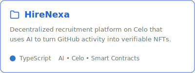
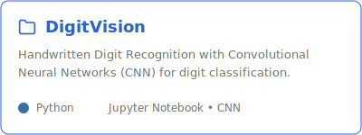
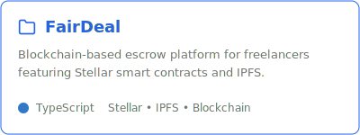
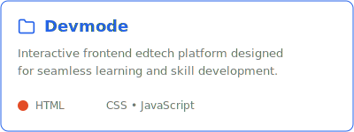

# Hi there, I'm Debjani Mandal

*Passionate about building intelligent systems and solving real-world problems with Artificial Intelligence.*

---

##  About Me

-  I am a **3rd year AI/ML student** deeply passionate about the mathematics and magic behind neural networks.
-  Actively exploring and building systems in **Artificial Intelligence, Machine Learning, and Computer Vision**.
-  Always enthusiastic about applying AI to **real-world applications** and contributing to the **open-source** community.
-  Ask me about: **Python, Neural Networks, Computer Vision, and Generative AI**

---

##  Tech Stack & Tools

**Languages & Web**  

  

**AI / ML / Data Science**  

  

**Tools & Platforms**  

  

---

##  Featured Projects

  
  
   
  
  

---

##  AI & ML Interests & Currently Learning

<table>
  <tr>
    <td width="50%" valign="top">
      <h4> Core Interests</h4>
      <ul>
        <li><b>Machine Learning:</b> Building robust predictive models.</li>
        <li><b>Deep Learning:</b> Neural architectures & pattern recognition.</li>
        <li><b>Computer Vision:</b> Image processing & object detection.</li>
        <li><b>Generative AI:</b> Exploring LLMs & synthesizing data.</li>
        <li><b>Intelligent Systems:</b> Context-aware autonomous systems.</li>
      </ul>
    </td>
    <td width="50%" valign="top">
      <h4> Currently Learning</h4>
      <ul>
        <li>Advanced ML models and optimization techniques.</li>
        <li>Cutting-edge AI systems and state-of-the-art architectures.</li>
        <li>Deploying and building scalable AI applications.</li>
        <li>Integrating AI models into modern web backends.</li>
      </ul>
    </td>
  </tr>
</table>

---

##  GitHub Statistics

  
  
   
  

---

##  Thoughts

> *"AI is not going to replace humans, but humans with AI will replace humans without AI."*

**Fun fact:** When I'm not training models and fine-tuning hyperparameters, I'm probably theorizing about Artificial General Intelligence or hunting for the perfect dataset!

---

##  Connect With Me

  
  
  

