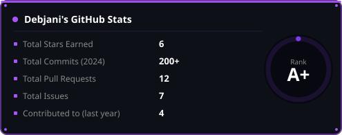
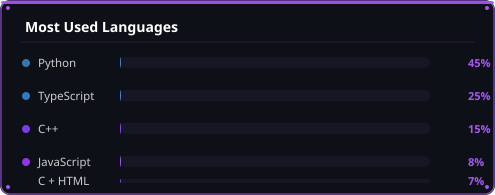



 

---

##  &nbsp; About Me

 

<table>
  <tr>
    <td align="right" width="38%">
       &nbsp;<b>debjani</b><code>@ai-terminal</code>
        
      
      
      
    </td>
    <td width="62%">
       
      <table>
        <tr>
          <td></td>
          <td><b>Name</b></td>
          <td>Debjani Mandal</td>
        </tr>
        <tr>
          <td></td>
          <td><b>Role</b></td>
          <td>4th Year AI / ML Student</td>
        </tr>
        <tr>
          <td></td>
          <td><b>Focus</b></td>
          <td>Machine Learning &nbsp;&bull;&nbsp; Computer Vision &nbsp;&bull;&nbsp; GenAI</td>
        </tr>
        <tr>
          <td></td>
          <td><b>Languages</b></td>
          <td>Python &nbsp;&bull;&nbsp; C++ &nbsp;&bull;&nbsp; TypeScript &nbsp;&bull;&nbsp; C</td>
        </tr>
        <tr>
          <td></td>
          <td><b>Ask Me</b></td>
          <td>Neural Networks &nbsp;&bull;&nbsp; CV &nbsp;&bull;&nbsp; Open Source</td>
        </tr>
        <tr>
          <td></td>
          <td><b>Open To</b></td>
          <td>Collaborations &nbsp;&bull;&nbsp; Research &nbsp;&bull;&nbsp; Internships</td>
        </tr>
        <tr>
          <td></td>
          <td><b>Fun Fact</b></td>
          <td>I debug models the same way I debug life — one layer at a time</td>
        </tr>
      </table>
       
    </td>
  </tr>
</table>

##  &nbsp; Tech Stack & Arsenal

**Languages & Web**

  

**AI / ML / Data Science**

  
  
  
  
  

**Tools & Platforms**

  

##  &nbsp; Featured Projects

<table>
  <tr>
    <td width="50%">
      <h3 align="center">HireNexa</h3>
      

        
          
        

          
          
        

      

    </td>
    <td width="50%">
      <h3 align="center">DigitVision</h3>
      

        
          
        

          
          
        

      

    </td>
  </tr>
  <tr>
    <td width="50%">
      <h3 align="center">FairDeal</h3>
      

        
          
        

          
          
        

      

    </td>
    <td width="50%">
      <h3 align="center">SolveMint</h3>
      

        
          
        

          
          
        

      

    </td>
  </tr>
</table>

##  &nbsp; AI & ML Focus Areas

|  Core Interests |  Currently Learning |
|---|---|
| **Machine Learning** &mdash; Robust predictive models | Advanced ML optimization techniques |
| **Deep Learning** &mdash; Neural architectures & patterns | State-of-the-art model architectures |
| **Computer Vision** &mdash; Image processing & detection | Scalable AI deployment & MLOps |
| **Generative AI** &mdash; LLMs & synthetic data | Integrating AI into modern web backends |
| **Intelligent Systems** &mdash; Context-aware autonomous agents | Reinforcement Learning fundamentals |

##  &nbsp; GitHub Statistics

 

 

  

##  &nbsp; Thoughts

> *"AI is not going to replace humans, but humans with AI will replace humans without AI."*

 

 &nbsp; When I am not training models or fine-tuning hyperparameters, I am probably theorizing about Artificial General Intelligence or hunting for the perfect dataset.

##  &nbsp; Connect With Me

 

&nbsp;

&nbsp;

  

